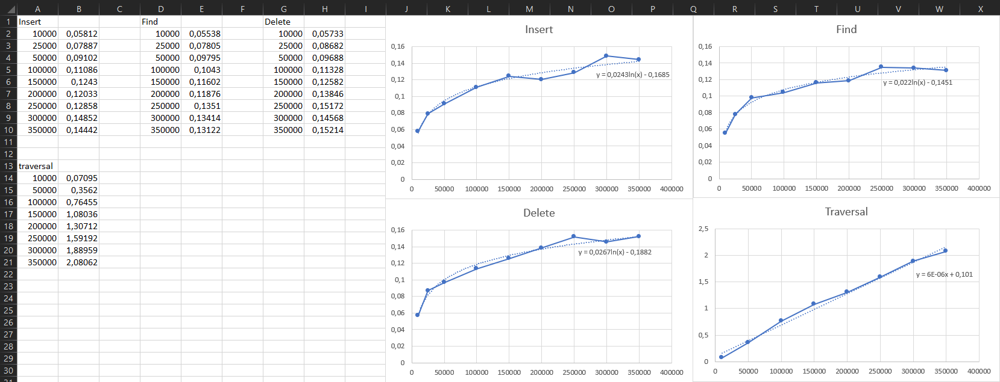

# Lab 4a

> «Работа с двоичным деревом поиска»

# Вариант №20
## Основные параметры дерева
### Поддерживаемые типы данных

Должны поддерживаться следующие типы данных:

+ ключ — нуль-терминированная строка произвольной длины;
+ значение — беззнаковое целое число.

### Содержимое узла

Узел дерева должен содержать:

+ ключ;
+ указатели на правое и левое поддеревья;
+ указатель на следующий и/или предыдущий узлы (в соответствии с операцией обхода);
+ указатель на информационное поле.

Таким образом, необходимо реализовать дерево поиска с прошивкой.

### Принцип работы с дублирующимися ключами

В дереве не могут храниться записи с дублирующимися ключами.

## Операции, поддерживаемые деревом

### Добавление нового элемента

Добавление нового элемента в дерево без нарушения свойств упорядоченности. Если запись с данным ключом уже присутствует в дереве, а дублирование ключей не допускается, то необходимо вернуть ошибку

### Удаление элемента

Удаление элемента, заданного своим ключом, без нарушения свойств упорядоченности дерева. Если в дереве присутствуют несколько элементов с указанным ключом, то необходимо передать номер удаляемого элемента.

### Обход дерева

Вывод содержимого дерева в обратном порядке следования ключей в заданном диапазоне.

### Поиск элемента по ключу

Поиск информации по заданному ключу. Если элементов с требуемым значением ключа может быть несколько, то необходимо указывать порядковый номер искомого элемента. Возврат необходимо осуществлять при помощи указателя, возврат копий элементов не допускается.

### Специальный поиск элемента

Поиск элемента с ключом, значение которого максимально отличается от заданного (если таких
элементов несколько — действовать по аналогии с операцией поиска по ключу).

## Графики зависимости времени выполнения операций от количества элементов в дереве. (Время для вставки/поиска/удаления 1000 элементов).



## Как установить и запустить проект:
1. Склонировать репозиторий проекта:
```bash
git clone https://git.dozen.mephi.ru/aisd2025/s24501_chesnokov.an.git
```
2. Скомпилировать код:
```bash
make
```

3. Запуск:
- Запустить реализацию:
```bash
./prog
```
